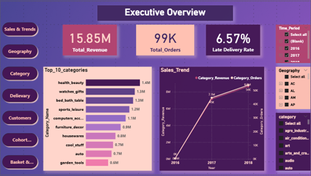
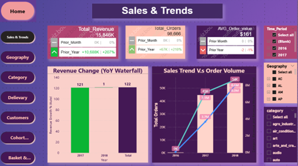
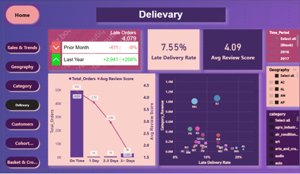
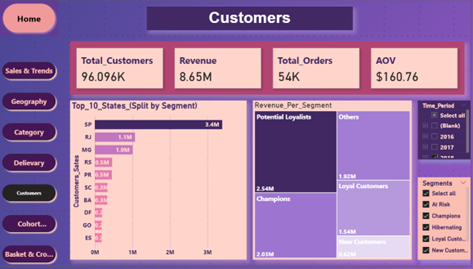

# Olist 360: Sales, Retention, Delivery & Customer Intelligence Dashboard

An end-to-end **Data Analyst / Business Intelligence project** built using **SQL, Python, and Power BI** on the **Olist Brazilian E-Commerce Public Dataset**.

This project was designed to provide a unified analytical view of marketplace performance across **sales trends, customer retention, delivery operations, product/category performance, customer satisfaction, and basket cross-sell opportunities**.

---

## Project Overview

Olist 360 is a business intelligence and customer analytics project created to help business users move from fragmented operational reporting to a more strategic understanding of:

- what drives revenue
- where operational gaps exist
- which customers and categories create the most value
- which business levers can improve long-term performance

The project combines:

- data cleaning and validation
- analytical feature engineering
- exploratory data analysis (EDA)
- Power BI dashboard design

into one decision-support framework.

---

## Business Problem

The business lacks a unified analytical view connecting:

- sales performance
- customer loyalty
- delivery operations
- customer satisfaction

Without this integration, it becomes difficult to identify the true drivers of growth, detect operational bottlenecks, and understand retention behavior.

---

## Project Objectives

This project was built to answer the following business questions:

1. How have revenue and order volume changed over time?
2. Which geographies drive revenue growth?
3. Which categories generate the highest revenue and which underperform?
4. How do delivery delays affect customer satisfaction?
5. Which customer segments are the most valuable?
6. How strong is customer retention over time?
7. Which basket and cross-sell opportunities can increase value per order?

---

## Tools & Technologies

- **SQL** → schema validation, relational checks, data preparation
- **Python** → cleaning, preprocessing, feature engineering, EDA
- **Power BI** → data modeling, DAX KPIs, dashboards
- **Jupyter Notebook** → analytical workflow documentation

---

## Analytical Scope

The project covers the following analytical themes:

- **Sales & Trends**
- **Geography Performance**
- **Category Performance**
- **Delivery & Customer Satisfaction**
- **Customer Segmentation (RFM)**
- **Cohort Retention**
- **Basket & Cross-Sell Analysis**

---

## Key Insights

### 1. Revenue growth was strong but volume-driven
- The business reached its strongest month in **November 2017**
- Revenue growth was driven mainly by **higher order volume**
- AOV remained relatively stable during the active growth period

### 2. Revenue is highly concentrated geographically
- **SP, RJ, and MG** contribute the majority of total revenue
- Smaller states show higher AOV and may represent premium-value opportunities

### 3. Category performance is uneven
- A limited number of categories drive most of the revenue
- Some categories underperform in customer satisfaction and delivery performance

### 4. Delivery delays have a strong negative effect on review scores
- Late deliveries are associated with significantly lower customer satisfaction
- Delays beyond **3 days** represent a critical threshold

### 5. The business is highly acquisition-driven
- The customer base is dominated by **one-time buyers**
- Repeat customers are more valuable, but too few to materially impact the business model

### 6. Retention is structurally weak
- Cohort analysis shows retention drops sharply after the first purchase
- Long-term customer retention remains very low across cohorts

### 7. Basket expansion is a growth opportunity
- Multi-category baskets have higher order value
- Cross-sell rules reveal practical recommendation and bundling opportunities
- Most basket growth potential lies in expanding beyond single-category purchases

---

## Dashboard Pages

The Power BI solution includes the following dashboard pages:

- **Executive Overview**
- **Sales & Trends**
- **Geography**
- **Category Performance**
- **Delivery & Satisfaction**
- **Customers / RFM**
- **Cohort Retention**
- **Basket & Cross-Sell**

---

## Files Included

### Report
- Final project report (PDF / DOCX)

### Dashboards
- Dashboard screenshots
- Power BI dashboard file (if shared separately)

### Notebook
- Jupyter notebook used for preparation, EDA, and feature engineering

### SQL
- SQL scripts used for data preparation, checks, and validation
---

## Dashboard Preview



### Sales & Trends


### Delivery & Satisfaction


### Customers / RFM


For additional visuals, see the full screenshots inside the **dashboards/screenshots/** folder.

---

## Data Source

This project uses the **Brazilian E-Commerce Public Dataset by Olist**.

- **Source / Provider:** Olist
- **Original dataset page:** https://www.kaggle.com/datasets/olistbr/brazilian-ecommerce
- **Dataset summary:** Public Brazilian e-commerce dataset containing approximately 100k orders from 2016 to 2018, with order, payment, freight, customer, seller, product, review, and geolocation information. The dataset is anonymized according to the source description.
---
## Dataset License & Attribution

The dataset included/referenced in this repository is attributed to **Olist** and sourced from the original Kaggle page:

https://www.kaggle.com/datasets/olistbr/brazilian-ecommerce

If the original dataset page specifies the license as **Creative Commons Attribution-NonCommercial-ShareAlike 4.0 International (CC BY-NC-SA 4.0)**, then redistribution and reuse in this repository are intended to follow that license.

License link:
https://creativecommons.org/licenses/by-nc-sa/4.0/

Under this license:
- **Attribution (BY):** Proper credit must be given to Olist and the original source.
- **NonCommercial (NC):** The dataset and this redistribution are intended for non-commercial, educational, and portfolio purposes only.
- **ShareAlike (SA):** If the dataset has been modified, transformed, or adapted, those contributions must be shared under the same license.
- **No endorsement:** Nothing in this repository implies that Olist endorses me, this project, or any derived analysis.
- ----
## Changes Made to the Data

The original dataset was obtained from the source above. In this repository, I may have performed one or more of the following steps for analysis purposes:

- cleaned missing or inconsistent values
- standardized column names or data types
- created derived analytical tables / feature tables
- aggregated records for reporting or modeling
- added data quality flags
- joined source files into analysis-ready datasets

Any such modifications are for educational and portfolio purposes and should be treated as derivative analytical work based on the original dataset.
-----
## Non-Commercial Use Notice

This repository is published for **educational, learning, and portfolio purposes only**.

The dataset is **not provided here for commercial reuse**.  
If you wish to use the data beyond non-commercial purposes, please consult the original source and license terms directly.
----
## Redistribution Notice

Raw and/or processed dataset files included in this repository are redistributed solely for convenience and reproducibility, subject to the original dataset’s license terms.

If you use, copy, modify, or redistribute these files, you are responsible for complying with the original license conditions, including attribution, non-commercial use, and share-alike requirements where applicable.
--------


##  Business Value
This project demonstrates how a Data Analyst can move from raw transactional data to:

executive KPI design
structured analytical modeling
business-focused dashboards
strategic recommendations

The project highlights three major business opportunities:

improving delivery reliability
strengthening customer retention
expanding baskets through cross-sell strategies

---

##  Author
**Ramy Safwat**
**Role:** Business Analyst / Business Intelligence Portfolio Project
---
## Repository Structure

```text
report/                  -> final project report
dashboards/screenshots/  -> dashboard screenshots
notebooks/               -> Jupyter notebooks
sql/                     -> SQL scripts
data/                    -> data notes / cleaned data references
assets/                  -> additional supporting files
